---
lab:
    title: 'TechLab: Workforce Management'
    description: 'Configure Dynamics 365 Contact Center Workforce Management, including agent skills, forecasting, capacity plans, shift scheduling, and self-service requests.'
    level: 400
    duration: 120 minutes
    islab: true
    primarytopics:
---

@lab.Title

**Please enter your own Microsoft alias (without @microsoft.com) in the field below before starting the lab**. This information is required to correctly associate your activity with your learner record and ensure your completion is accurately captured and reported. For data integrity and compliance reasons, learners may only enter their own alias. After completing the lab, please allow up to 5 business days for all reporting systems to fully reflect your completion.

@lab.ActivityGroup(aliascapture)

===

## Survey

@lab.ActivityGroup(initialsurvey)

===
> [!IMPORTANT] 
> Before proceeding, you must complete the prerequisite lab, [TechLab: Sales and Service MDX Set Up](https://csu.learnondemand.net/Course/49687 "TechLab: Sales and Service MDX Set Up"). This lab depends on configuration completed in that prerequisite. If you have not already completed it, you will not be able to complete the tasks in this lab. If you have already begun this lab, please exit now, complete the prerequisite lab, and then return to this lab afterward.

## Where does this fit in as part of an end-to-end demo?

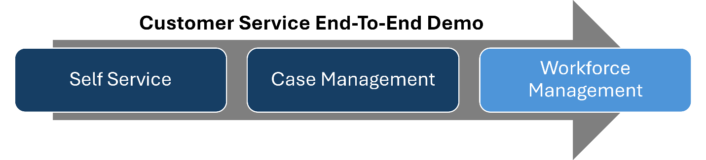

## Business context

Contoso Coffee stands as one of the leading producers of premium coffee machines in the United States, boasting an extensive clientele that surpasses 5 million customers and revenue of $1 billion. This customer base is provided with a variety of sophisticated coffee machines, in addition to options for ordering coffee supplies, service agreements, and extended warranties. Contoso caters to both business-to-business (coffee shops) and business-to-consumer (individual buyers) markets.

During Contoso Coffee's seasonal product launch, a surge in customer inquiries about new flavors, water tank maintenance, and warranties exposed major flaws in its workforce management systems. With over 2,000 agents scheduled manually using ServiceNow and Genesys Engage, mismatches between staffing and demand led to long wait times, missed shifts, and compliance risks, while the lack of predictive analytics and real-time scheduling tools caused overstaffing during slow periods and understaffing during peak hours, frustrating customers and burning out agents. These issues highlight the urgent need for AI-driven solutions to streamline scheduling, shift swaps, and capacity planning.

## Challenges

Contoso is experiencing significant challenges in managing its global customer service workforce:

- Inconsistent staffing across time zones and seasonal demand fluctuations.

- Manual scheduling processes that are time-consuming and error-prone.

- High agent turnover due to lack of scheduling flexibility and visibility.

- Limited visibility into agent performance and adherence.

- Difficulty forecasting demand during promotions, holidays, and product launches.

- Inability to quickly reallocate resources during unexpected demand surges.

## Why are we talking to Contoso?

Contoso's current approach relies very heavily on manual processes or overly complicated scheduling tools. The lack of dynamic data makes it difficult to respond quickly to changing customer demand. Contoso is looking to move away from its current system in ServiceNow to a solution that will help it modernize its workforce management capabilities and unify its global support operations under a single, intelligent platform.

## Desired outcome breakdown

### Key outcomes:

- Implement AI-driven forecasting to predict contact volumes across channels and regions.

- Automate agent scheduling based on skills, availability, and demand.

- Improve agent satisfaction with self-service shift management tools.

- Monitor real-time adherence and performance metrics.

- Reduce operational costs through optimized staffing and reduced overtime.

### How Dynamics 365 Contact Center helps:

- AI-powered forecasting engine uses historical and real-time data.

- Schedule builder supports multi-skill, multi-time zone optimization.

- Agent portal allows shift bidding, time-off requests, and swaps.

- Real-time dashboards provide supervisors with adherence and productivity insights.

- Integration with HR systems ensures up-to-date agent availability and compliance.

## Learning Objectives

Upon successful completion of this lab, you'll:

- Enable Workforce Management in Dynamics 365 Contact Center.

- Configure the necessary supporting components.

- Create and manage forecasts using historical and imported data.

- Build and publish optimized schedules.

- Configure and demonstrate agent self-service features.

Estimated time to complete this workshop: **75-90 minutes**

## Prerequisites 

> [!WARNING] 
> You must complete the required steps in the **TechLab: Sales and Service MDX Set Up** lab before you start this lab. This ensures that your environment is configured properly and includes all resources that are required to support this lab.

===

# Exercise 01: Create supporting components

## Introduction
Contoso's biggest pain point is that scheduling decisions aren't driven by skills, availability, or real demand, resulting in overstaffing during slow periods and understaffing during peak hours. To fix that, Workforce Management needs the foundational building blocks that make optimization possible: enabled features, manager relationships, skills and proficiency, bookable resources with working hours, shift activities, time-off types, and queues for routing. In this exercise, you'll configure these core components so Contoso can later forecast accurately, plan capacity, and build schedules that reflect real operational constraints.

## Task 01: Enable Workforce management options

### Introduction

Contoso can't move from manual scheduling to AI-driven planning until Workforce Management capabilities are enabled across forecasting, scheduling, and agent self-service.

### Description

In this task, you turn on the Workforce Management features required for forecasting, capacity planning, schedule management, shift-based routing, and agent self-service capabilities like bidding and swapping.

### Success criteria
- Workforce Management features are enabled and available for configuration and use across forecasting, planning, scheduling, and self-service.

### Key steps

1. In your web browser, go to **Dynamics 365**. The URL should resemble **https://org6e56877e.crm.dynamics.com/**.

1. If prompted, sign in by using the administrator credentials for your demo environment.

1. On the **Published Apps** page, select **Copilot Service admin center**.

	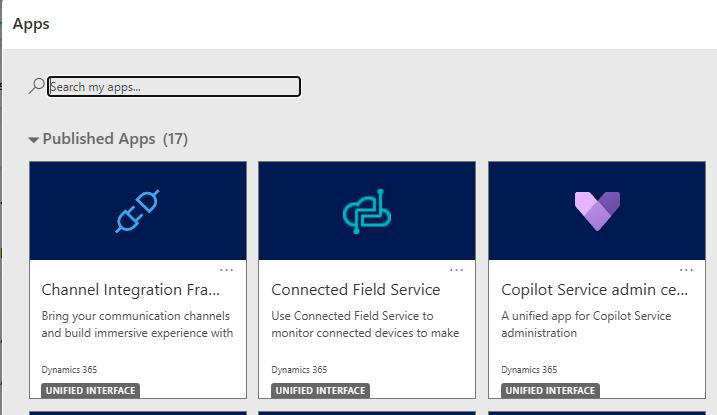

1. In the left navigation pane, in the **Operations** section, select **Workforce management**.

	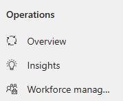

1. In the **Time management** section, locate the **Representative calendar** option and select **Manage**.

	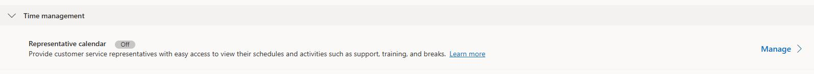

1. Set **Enable my schedule for agents** to **On**.

	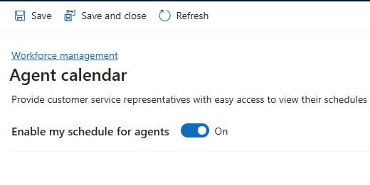

1. On the command bar, select **Save & Close**.

1. In the **Forecasting** section, turn on the following feature:
    
    - Capacity planning
    
    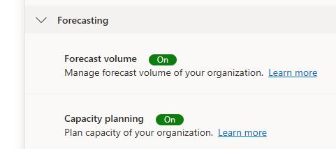
    
1. In the **Shift and schedule management** section, turn on the following features:

    - Schedule management
    - Shift-based routing

	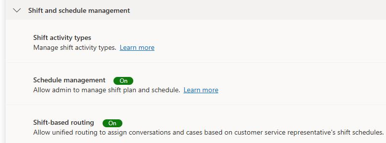

1. In the **Time management** section, turn on the following features:

	- Representative calendar
    - Bidding
    - Swapping
    
    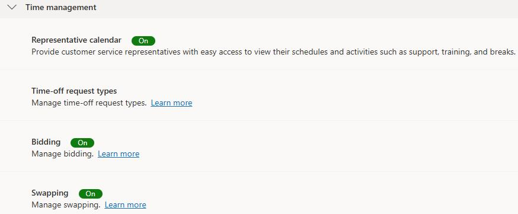

===

## Task 02: Assign managers

### Introduction

Shift swaps, bidding, and time-off requests require clear reporting relationships so approvals and accountability work at scale across Contoso's global support team.

### Description

In this task, you assign managers to agents so requests such as time off, swaps, and bids can follow an approval path and support better workforce visibility.

### Success criteria

Managers are assigned to the required users so shift and time-off workflows can be submitted and approved.

### Key steps

1. In **Copilot Service admin center**, in the left navigation pane, select **Workforce Management**.

	
	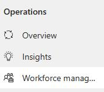

1. In the **User Management** section, select **View**.

	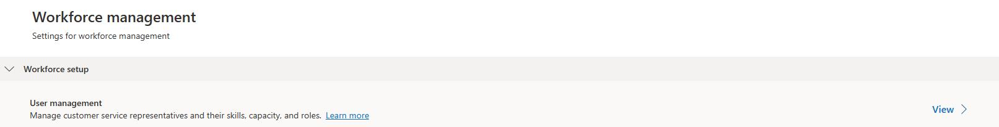

1. Locate **Users** and then select **Manage**.

	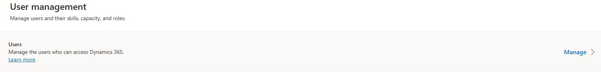

1. Select **Enabled Users** and then select **Agents** to change the view.

	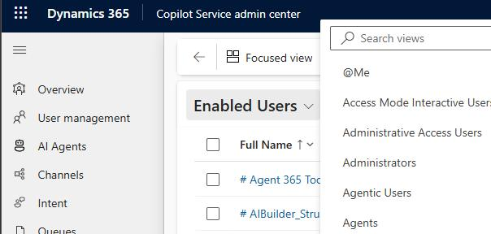
	
1. Select your administrative account.

	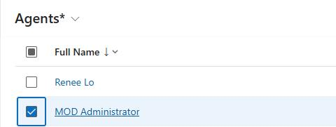
	
1. Select the **Summary** tab. On the right side of the page, on the **Organization Information** tile, in the **Manager** field, set the value to **Alan Steiner**.

    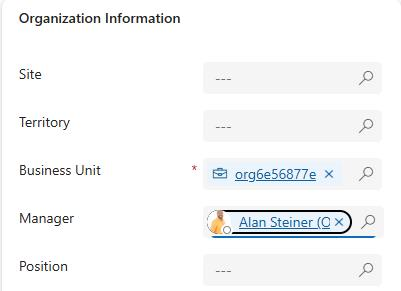

1. On the command bar, select **Save & Close**.

	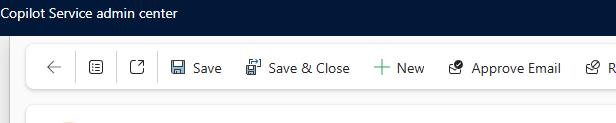

1. In the list of agents, select the **Alex Baker** record. On the **Organization Information** tile, in the **Manager** field, set the value to your administrative account.

	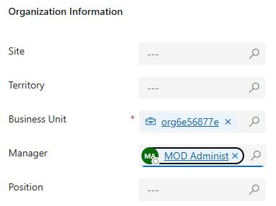

1. Repeat Step 8 to assign your administrative account as the **Manager** for the following users:

    - Alicia Thomber
    - Amy Alberts
    - Anita Montero
    - Benjamin Mcphee
    - David Mallory
    - Molly Clark
    - Nancy Warner
    - Renee Lo
    - Spencer Low

===

## Task 03: Create skills and proficiency levels

### Introduction

Contoso's staffing challenges worsen when the wrong skills are scheduled against the wrong demand, especially during seasonal surges and product launches.

Description

In this task, you'll create the skill framework (for example, Commercial, Residential, Subscriptions, Warranty, Repair) that will be used for forecasting, routing, and schedule optimization.

### Success criteria

The required skills are created and available to assign to customer service representatives.

### Key steps

1. In **Copilot Service admin center**, in the left navigation pane, select **Workforce Management**.

	
	

1. In **User management**, select **View.**

1. In **Skills**, select **Manage**.

1. In the **Active Characteristics** view, select **+ New**.

1. In the **New Characteristic** form, configure the required fields as follows:

    - **Skill type:** Skill
    - **Skill name:** Commercial

1. Select **Save & Close**.

1. Repeat the steps above to add the following skills:

    | Name | Type |
    | -------- | -------- |
    | Residential    |Skill  |
    | Subscriptions    |  Skill|
    | Warranty    | Skill |
    | Repair    | Skill |

1. Your completed skills should resemble the image below (you may have more skills in the list if they already existed):

    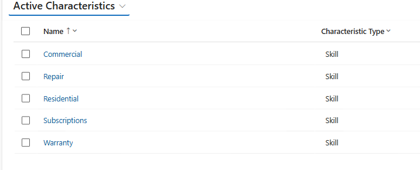

===

## Task 04: Assign skills and proficiency levels

### Introduction

To reduce long wait times and avoid overstaffing or understaffing, Contoso needs schedules that reflect who can handle which types of customer inquiries and how well.

### Description

In this task, you'll assign skills and proficiency levels to agents so the system can match staffing to demand by skill, not just headcount.

### Success criteria

- Agents have the required skills and proficiency levels assigned to support skill-based planning and scheduling.

1. In **Copilot Service admin center**, in the left navigation pane, select **Workforce Management**.

	
	

1. In the **User management** section, select **View**.

	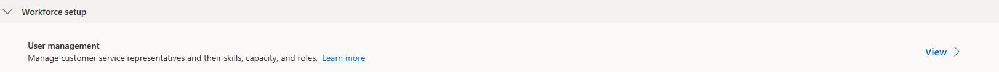

1. On the **User management** page, in the **Enhanced user management** section, select **Manage**.

	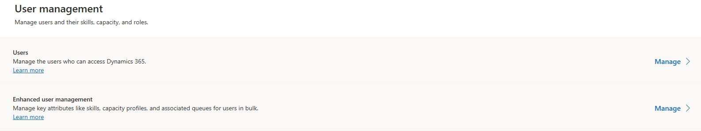

1. Select your admin account. On the command bar, select **Update user attributes**  and then select **Update skills**.

    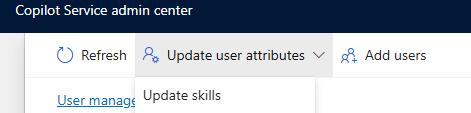

1. In the **Select proficiency** field, select **Excellent**. Then, in the **Skills** field, select **Commercial** and **Warranty**.  

   > [!WARNING]
   > You must select the proficiency level before selecting the skill.

1. Select **Add to all**.

    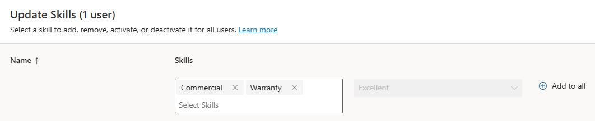

1. In the **Select proficiency** field, select **Very Good**. Then, in the **Skills** field, select **Residential** and **Repair**.

1. Select **Add to all**.

    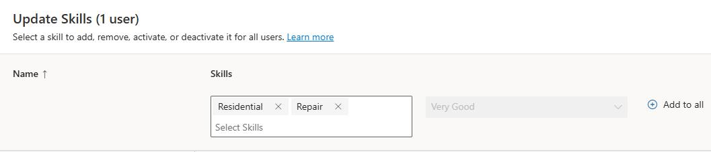

1. In the **Select proficiency** field, select **Fair**. Then, in the **Skills** field, select **Subscriptions**.

1. Select **Add to all**.

    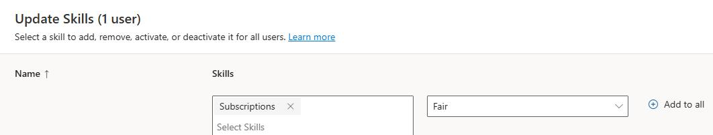

1. Select the **Save** button.

1. Repeat the steps to define skills for additional users as follows:

    | Rep | Fair | Very Good | Excellent |
    | -------- | -------- | -------- | -------- |
    | Alan Steiner | Commercial | Warranty, Residential | Repair, Subscriptions |
    | Alex Baker | Warranty | Residential | Commercial, Repair, Subscriptions |
    | Alicia Thomber | Repair, Residential | Commercial, Subscriptions, Warranty |          |
    | Amy Alberts | Subscriptions | Commercial, Repair | Warranty, Residential |
    | Anita Montero | Commercial | Warranty, Residential | Repair, Subscriptions |
    | Benjamin Mcphee | Subscriptions | Commercial, Repair | Warranty, Residential |
    | David Mallory | Warranty | Residential | Commercial, Repair, Subscriptions |
    | Molly Clark | Repair, Residential | Commercial, Subscriptions, Warranty |          |
    | Nancy Warner | Subscriptions | Commercial, Repair | Warranty, Residential |
    | Renee  Lo | Warranty | Residential | Commercial, Repair, Subscriptions |
    | Spencer Low | Repair, Residential | Commercial, Subscriptions, Warranty |          |

<!---

## Task 05: Create bookable resources

### Introduction

Workforce scheduling depends on each agent being a schedulable resource with defined working hours, especially across time zones and demand peaks.

### Description

In this task, you create bookable resources for agents and define standard working hours so schedules, capacity plans, and bookings can be generated accurately.

### Success criteria
- Bookable resources exist for the targeted agents and have valid working hours configured.

1. Make sure that you are in the **Copilot Service admin center** app.

1. Using the navigation on the left, select **Workforce management**.

1. In **Workforce setup screen**, next to **User management**, select **View.**

1. Select **Manage** next to **Users**.

1. Change the **View** from **Enabled Users** to **Agents**.

1. Select **your admin user account** (or equivalent) to open it, and then select the **Omnichannel** tab.

    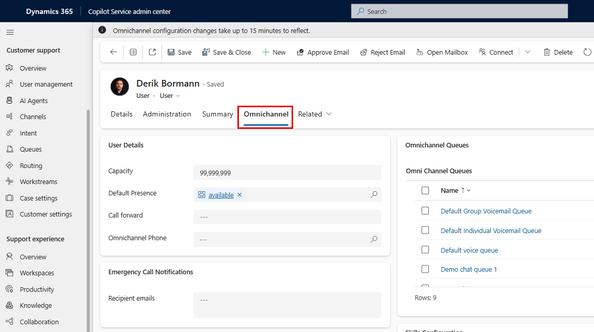

1. On the **Skills Configuration** card, select **New Bookable Resource**.

    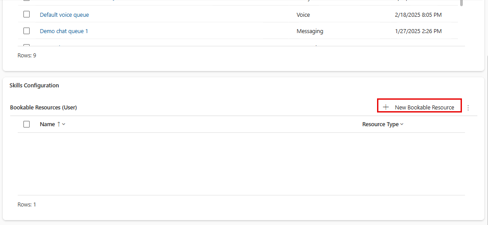

1. Enter the following details:

    - **Resource Type**: Select **User**.

    - **User**: Should be set to your user account

    - **Name**: Enter your admin username.

    - **Time zone**: Select your time zone from the dropdown menu.

    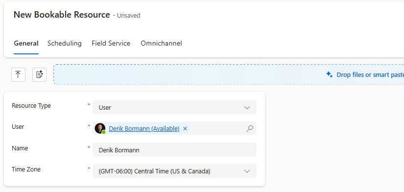

1. Select the **Save and Close** button (if you were creating a new record).

1. Select the **Show Work Hours** button.

    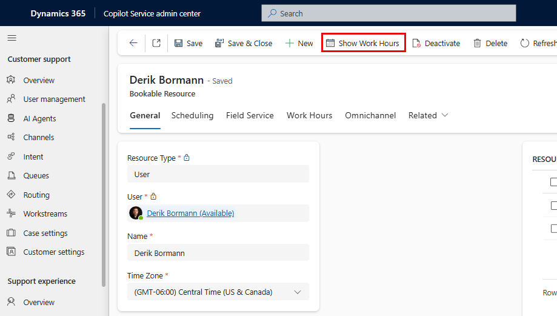

1. Remove any working hours that are currently defined by selecting them, then **Delete all events** in the series and then select **OK**.

    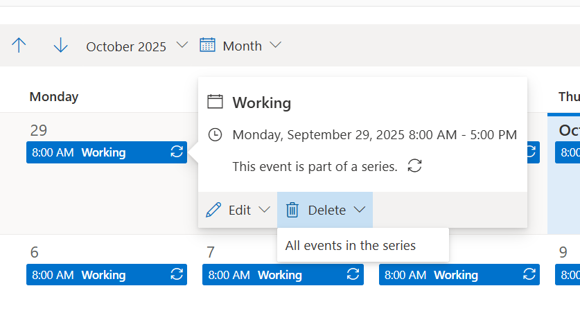

1. Select **New**, then **Working Hours**, to add new working hours.

1. Configure the working hours as follows:

    - **Repeat**: Every Week

    - **Days:** Monday - Friday

    - **Start time:** 8:00 AM

    - **End time:** 5:00 PM

    - **Time Zone:** Set to your time zone.

    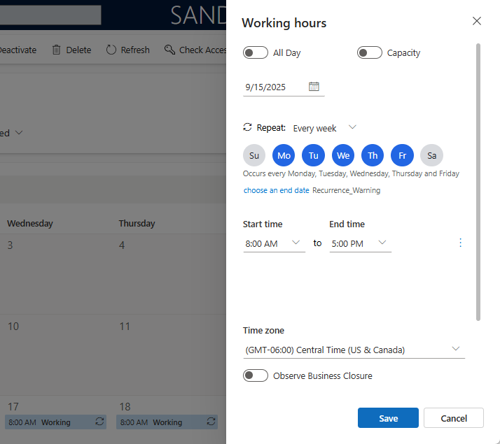

1. Select **Save** 

    >[!note] If you receive a calendar conflict error, you can select OK.

1. Select the **Save and Close** button.

    Repeat steps 5 through 13 to create bookable resource records and define working hours for the following users.

    - Alan Steiner

    - Alex Baker

    - Alicia Thomber

    - Amy Alberts

    - Anita Montero

    Optionally, you can repeat the steps for the below users if you want to. Doing so will provide you with more individuals to choose from when doing shift planning and scheduling.

    - Benjamin Mcphee

    - David Mallory

    - Molly Clark

    - Nancy Warner

    - Renee Lo

    - Spencer Low

## Task 05: Create Shift Activity types

### Introduction
Contoso needs schedules that reflect real work: time on chat, email, voice, training, and breaks, so coverage and adherence can be measured and improved.

### Description
In this task, you create standardized shift activity types with durations and colors that will be used to build shift plans and visualize schedules.

### Success criteria
- Shift activity types are created with the required durations and are available to add to shift plans.

If they do not, please change them. Otherwise, skip to Task 7.

1. If necessary, open the **Copilot Service admin center** app.

1. Using the navigation on the left, under **Workforce management**, select **Manage** next to **Shift activity Types.**

    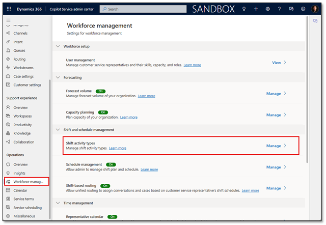

1. Select the **+ New** button.

1. Configure the **Shift activity** type as follows:

    - **Name:** Break

    - **Description:** Break Time

    - **Automatic Assignment Status:** Assignable

    - **Duration:** 30 Mins

    - **Color:** #c890f5

    - **Dark theme Color:** #c890f5

1. Select the **Save and Close** button.

1. Repeat the steps above to add the following **Shift Activity Types**:

    | Name  | Description  | Duration  | Color  | Dark Color |
    | -------- | -------- | -------- | -------- | -------- |
    | Chat Customer Support  | Provide support through Chat  | 1 Hr 30 Mins  | #90bcfs  | #90bcfs  |
    | Email Customer Support  | Providing Support through Email  | 1 Hr 30 Mins | #f1f590  | #f1f590  |
    | Training  | Training Sessions  | 30 Mins   | #f57398  | #f57398 |
    | Voice Customer Support  | Provide Support via Voice  | 1 Hr 30 Mins | #f5da90  | #f5da90  |
--->
===

## Task 05: Create time-off request types

### Introduction
High turnover and burnout are often driven by inflexible scheduling, so Contoso needs a consistent way for agents to request time off within the same system used for staffing.

### Description
In this task, you'll create time-off request types (Vacation, PTO, Unpaid, Sick Leave) so agents can submit requests and supervisors can manage coverage impacts.

### Success criteria
- Time-off request types are created and available for agents to use in self-service workflows.

#### Key steps

1. In **Copilot Service admin center**, in the left navigation pane, select **Workforce Management**.

	
	

1. Locate the **Time management** section.

1. In the **Time management** section, locate **Time-off request types** and select **Manage**.

	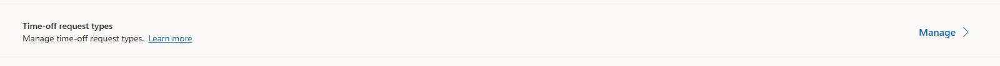
	
1. On the command bar, select **+ New**.

	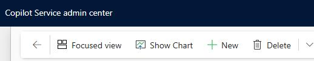

1. Configure the **Time-off Activity** type as follows:

    - **Name:** Vacation
    - **Description:** Represents Vacation time
    - **Color:** #51db84
    - **Dark theme Color:** #51db84

    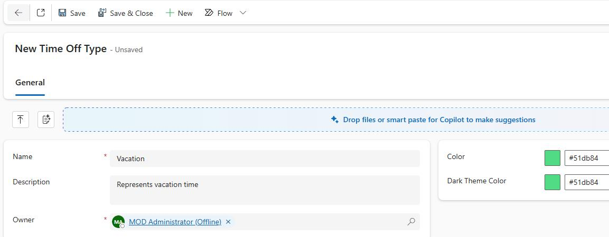

1. On the command bar, select **Save & Close**.

	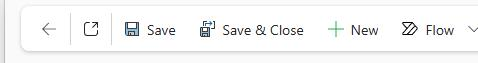

1. Repeat Steps 4 through 6 to add the following time-off types:

    | Name  | Description  | Color  | Dark Color  |
    | -------- | -------- | -------- | -------- |
    | PTO  | Represents Paid time Off | #7451db | #7451db |
    | Unpaid | Represents unpaid time off | #db51c2 | #db51c2 |
    | Sick Leave | Represents extended sick leave | #db9651 | #db9651 |

===

## Task 06: Configure queues

### Introduction
To align staffing with demand in real time, Contoso needs routing that respects who is scheduled, skilled, available, and actively working.

### Description
In this task, you'll create a queue and configure shift-based routing rules so incoming work can be assigned to agents based on skills, presence, capacity, and calendar schedule.

### Success criteria
A queue and shift-based routing ruleset are configured so work can be routed to scheduled, qualified, available agents.

### Key steps

1. Open **Copilot Service admin center**.

1. In the left navigation pane, in the **Customer support** section, select **Queues**.

	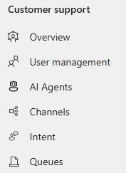
	
1. Locate **Advanced Queues** and then select **Manage**.

	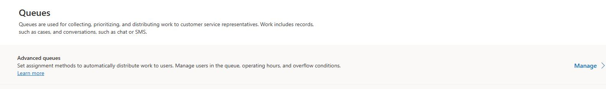

1. On the command bar, select **+ New queue**.

	

1. Configure the queue as follows and then select **Create**:

    - **Name:** Shift Based Routing
    - **Type:** Messaging
    - **Queue Priority:** 10

	> [!TIP] 
    > Unified routing prioritizes a queue with a smaller number over a queue with a larger number.

	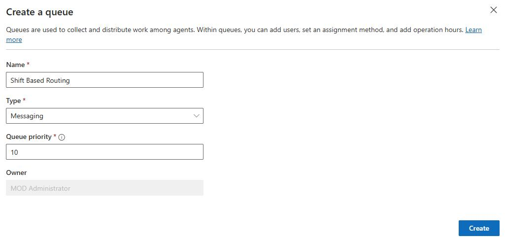
	
1. On the **Shift Based Routing** page, on the **Add Users to this Queue** tile, select **+ Add users**.

    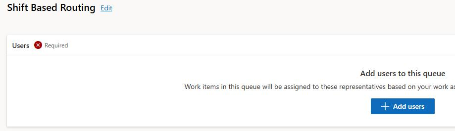

1. Select the following users and then select **Add**:

    - Alan Steiner
    - Alex Baker
    - Alicia Thomber
    - Amy Alberts
    - Anita Montero
    - Benjamin Mcphee
    - David Mallory
    - Molly Clark
    - Nancy Warner
    - Renee Lo
    - Spencer Low

1. On the **Shift Based Routing** page, on the **Assignment method** tile, select **See more**.

	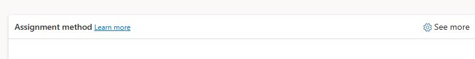

1. Select **Create new**.

	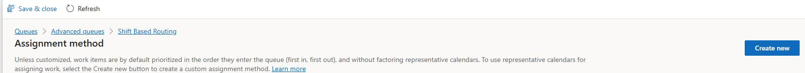
	
1. In the **Create work assignment** dialog, in the **Name** field, enter `Shift routing` and then select **Create**.

    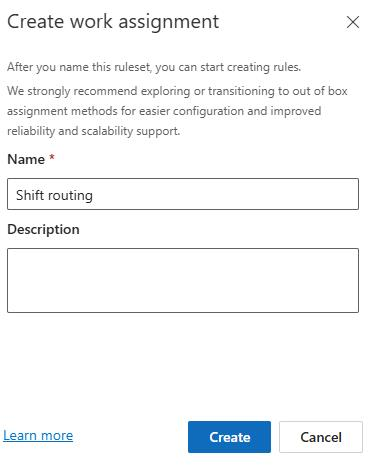

1. On the **Assignment rulesets** tile, select **+ Create Ruleset**.

	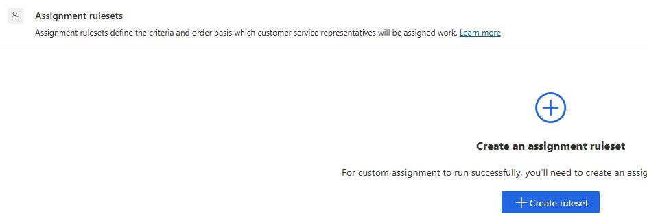

1. Select **+ New Ruleset**.

1. In the **Ruleset name** field, enter `Route reps` and then select **Create**.

    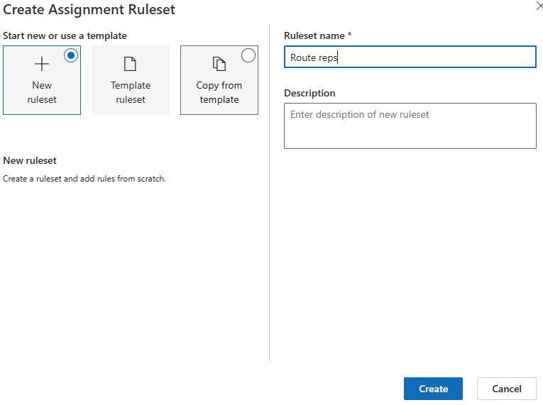

1. On the **Decision List** tile, select **+ Create Rule**.

	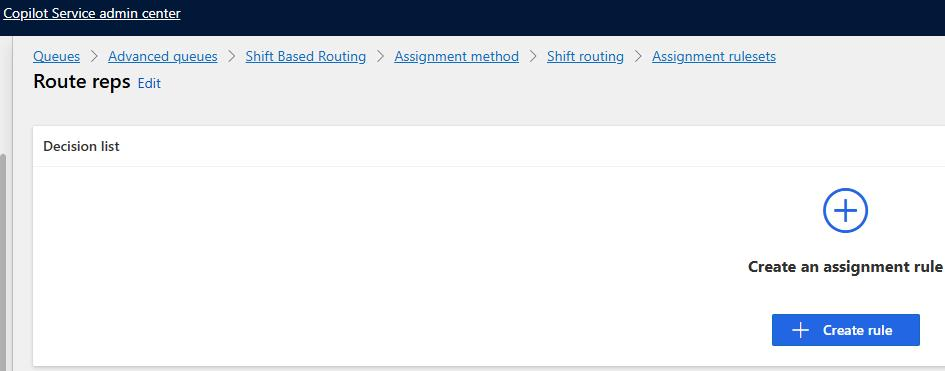

1. In the **Rule Name** field, enter `Shift routing demo`.

1. Configure the conditions as follows:

    - **User skills** > **Exact match** > **All skills**

    - **Presence status** > **Equals** > **Dynamic Match** > **Conversation** . **Workstream** . **Allowed Presences**

    - **Available capacity** **> Is greater than** > **Dynamic Match** > **Conversation** . **Workstream** . **Capacity**

    - **Calendar schedule** > **is working**

    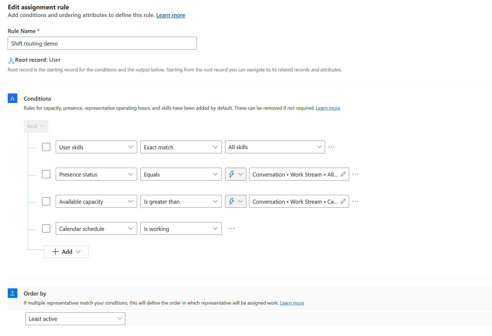

   > [!Note] 
   > Remove any additional conditions (ex. User Languages - User Regions)

1. In the **Order by** field, select **Least Active**.

    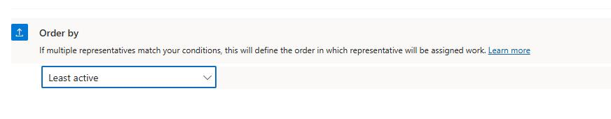

1. Select **Create**.

<!---

# Exercise 02: Create and configure forecasting

## Introduction
Contoso needs predictive analytics to anticipate demand spikes during promotions, holidays, and product launches, so staffing can be proactive instead of reactive. Forecasting is the starting point: it turns historical and imported volume data into forward-looking demand signals across channels and work types. In this exercise, you'll load external forecast data and create short-term and long-term forecasts for conversations and cases, establishing the demand baseline required for capacity planning and scheduling.

## Task 01: Setup Forecast External Data

### Introduction
Contoso's seasonal launches and promotions create demand spikes that are hard to manage with manual scheduling and limited analytics. Importing external data gives Workforce Management a reliable demand signal to forecast against.

### Description
In this task, you'll create external forecast data records for intraday and daily intervals, upload the provided data files, and confirm the data sources are available for building forecast scenarios.

### Success criteria
- Intraday and daily external forecast data sources are created and populated with uploaded files so they can be used in forecast scenarios.

1. In the **Copilot Service Workspace** application interface (not **the Copilot Service admin center**), open the menu by selecting the hamburger menu.

1. Navigate to **Workforce Management**, then to **Forecast External Data**.

    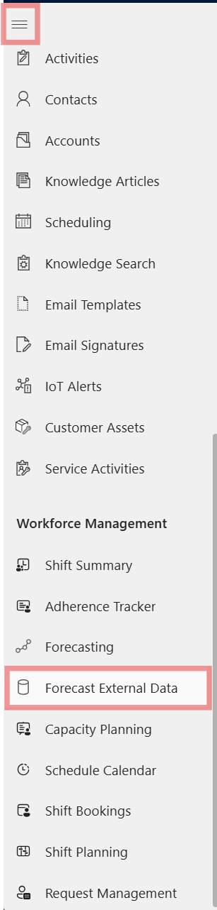

1. Select the **+ New** button.

1. In the **Name** field, enter **Contoso Intraday**.

1. In the **File data interval** field, select **Intraday**.

    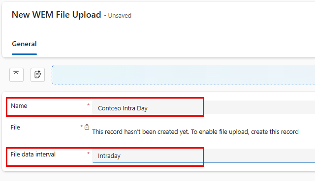

1. On the **Command bar**, select **Save**.  

    >[!Alert] You'll not be able to upload a file until you save the record.

1. Once saved, select **Choose file**.

1. Select the **Intraday Data-20250911** file that was included as part of your materials.

    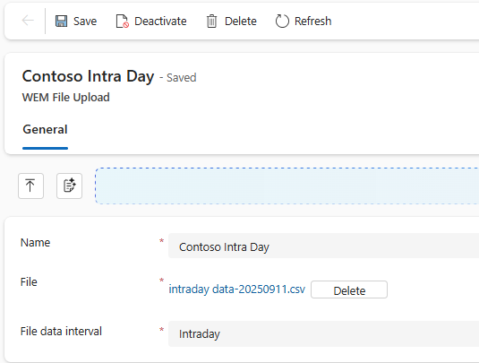

1. Once uploaded, select **Save**. 

    >[!Alert] You'll not receive any confirmation that the file was saved. Once you leave the record and return to the External Forecasts screen, you'll be able to view it.

1. Close the **Contoso Intra Day** record.

1. If needed, reopen **Workforce Management**, then **Forecast External Data**.

1. Select **+ New**.

1. In the **Name** field, enter **Contoso Daily**.

1. In the **File data interval** field, select **Daily**.

    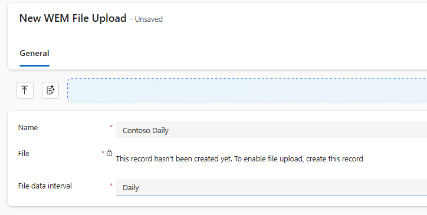

1. On the **command bar**, select **Save**.  

    >[!Alert] You'll not be able to upload a file until you save the record.

1. Once saved, select the **Choose File** button.

1. Select the **Daily Data-20250911** file that was included as part of your materials.

1. Once uploaded, select the **Save** button.

    >[!Alert] You'll not receive any confirmation that the file was saved. Once you leave the record and return to the External Forecasts screen, you'll be able to view it.

1. Close the **Contoso Daily** record.

## Task 02: Create forecasts

### Introduction
To reduce overstaffing during slow periods and understaffing during peak hours, Contoso needs forecasts that predict demand across different work types and time horizons.

### Description
In this task, you'll create short-term and long-term forecast scenarios using the external intraday and daily datasets, configure run schedules and parameters, and build forecasts for both conversations and cases.

### Success criteria
- Short-term and long-term forecasts for conversations and cases are created and saved with the correct external data sources and schedules.

>[!Note] If you did this as part of your pre-work, verify that everything looks as defined below.

> [!WARNING]
> The instructions indicate that you should name everything Sept. If you are doing this lab in any other month, for example, October or November, change the names to the correct month.

1. In the **Copilot Service Workspace** application interface (not the Copilot Service admin center), open the menu by selecting the hamburger menu, and then navigate to **Workforce Management** and **Forecasting**.

1. Select **+ New**.

1. Select **Short Term forecast scenario**.

1. Configure the forecast fields as follows:

    - **Name:** [Insert Current Month] Short term - Conversation

        - Ex. Sept Short Term - Conversation

    - **Duration:** 42

    - **Interval:** Short Term

    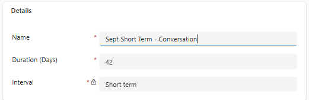

1. Under the **Historical data** section, configure the fields as follows:

    - **Data source:** External

    - **External data:** Contoso Intraday

    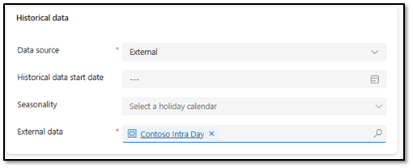

1. Under the **Configuration parameters**, in the **Forecast entity** field, select **Conversation**.

1. Under the **Forecast run schedule**, configure the fields as follows:

    - **Auto-extension:** Yes

    - **Run time slot:** 12 AM to 3 AM

    - **Run Time Zone:** Select your time zone.

    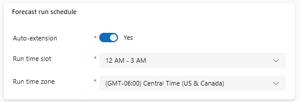

1. Select **Save**.

1. Close the **Sept Short Term Forecast** tab.

    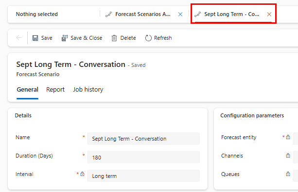

#### Now that you have created a short-term forecast, you're going to create a long-term one as well.

1. Select **+ New**.

1. Select **Long Term forecast** scenario.

1. Configure the forecast fields as follows:

    - **Name:** [Insert Current Month] Long Term - Conversation

    - **Duration:** 180

    - **Interval:** Long Term

    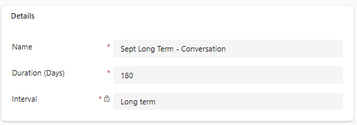

1. Under the **Historical data** section, configure the fields as follows:

    - **Data source:** External

    - **External data:** Contoso Daily

    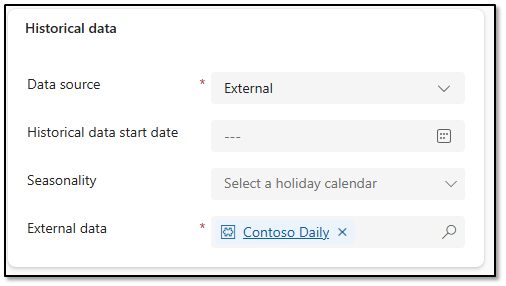

1. Under the **Configuration parameters**, in the **Forecast entity** field, select **Conversation**.

1. Under the **Forecast run schedule**, configure the fields as follows:

    - **Auto-extension:** Yes

    - **Day of the week:** Sunday

    - **Run time slot:** 12 AM to 3 AM

    - **Run Time Zone:** Select your time zone.

    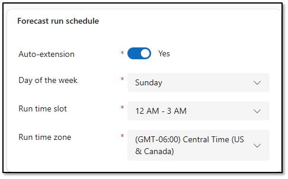

1. Select the **Save and Close** button.

### Task 03: Configure Case forecasts

Next, you're going to configure the same thing, only this time, for the case entity.

1. Select **+ New**.

1. Select **Short Term forecast** scenario.

1. Configure the forecast fields as follows:

    - **Name:** [Insert Current Month] Short Term Forecast - Case

    - **Duration:** 42

    - **Interval:** Short Term

    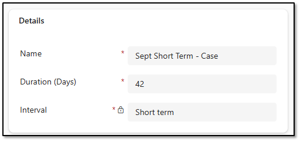

1. Under the **Historical data** section, configure the fields as follows:

    - **Data source:** External

    - **Historical data start date:** 1/1/2025

    - **External data:** Contoso Intra Day

    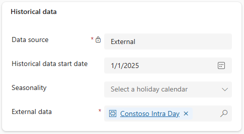

1. In the **Configuration parameters** section, configure the fields as follows:

    - **Forecast entity:** Case

    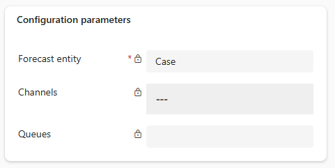

1. Under the **Forecast run schedule**, configure the fields as follows:

    - **Auto-extension:** Yes

    - **Run time slot:** 12 AM to 3 AM

    - **Run Time Zone:** Select your time zone.

    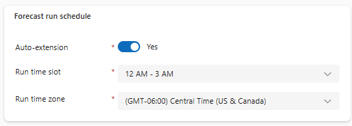

1. Select **Save** to save the record.

1. Close the **Sept - Short Term - Case** tab.

#### Lastly, we are going to configure the same thing, but this time for long-term forecasts.

1. Select **+ New**, then **Long term forecast scenario**.

1. Configure the forecast as follows:

    - **Name:** [Insert Current Month] Long Term - Case

    - **Duration:** 180

    - **Interval:** Long term

    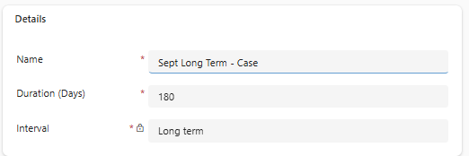

1. Under the **Historical data** section, configure the fields as follows:

    - **Data source:** External

    - **Historical data start date:** 1/1/2025

    - **External Data:** Contoso Daily

    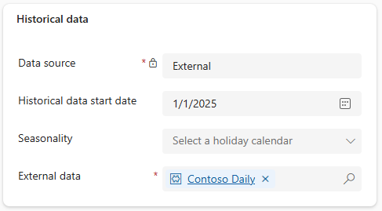

1. In the **Configuration parameters** section, configure the fields as follows:

    - **Forecast entity:** Case

    - **Channels:** Select All

    - **Queues:** Default entity queue

    

1. Under the **Forecast run schedule**, configure the fields as follows:

    - **Auto-extension:** Yes

    - **Day of the week:** Sunday

    - **Run time slot:** 12 AM to 3 AM

    - **Run Time Zone:** Select your time zone.

    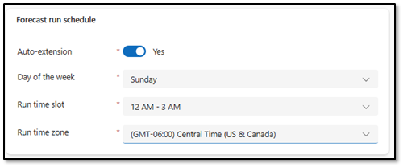

1. Select the **Save** button to save the record.

1. Close the **Sept Long-Term forecast** tab.
--->
===

# Exercise 02: Create capacity plans

## Introduction
Forecasts tell Contoso what demand is coming; capacity plans translate that demand into staffing requirements while accounting for real-world constraints like shrinkage, service-level targets, and answer-time goals. This is where Contoso begins to quantify the workforce needed to reduce wait times, control overtime, and avoid burnout. In this exercise, you'll create capacity plans aligned to your forecasts so Contoso can understand required staffing levels across both short-term and long-term horizons.

===

## Task 01: Create capacity plans

### Introduction
Forecasts help Contoso predict demand, but they still need a clear staffing plan that accounts for service-level goals, shrinkage, and workload patterns across channels. Capacity plans translate forecasted volume into required staffing so Contoso can reduce wait times, control overtime, and avoid burnout.

### Description
In this task, you'll create long-term and short-term capacity plans for both conversations and cases by selecting the appropriate forecast scenarios, configuring the run schedule, and setting key planning parameters such as service level, shrinkage, target answer time, and concurrency.

### Success criteria
- Long-term and short-term capacity plans for conversations and cases are created and saved using the correct forecast scenarios and planning parameters.

### Key steps

> [!WARNING]
> The capacity plans that you create here rely on the forecasts that you created in the prerequisite lab. You will not be able to select entries for the **Forecast Scenario** field if the forecasts were not created.

---

#### 01: Create a long-term capacity plan for conversations
1. Open the **Copilot Service workspace** app (not **Copilot Service admin center**).

	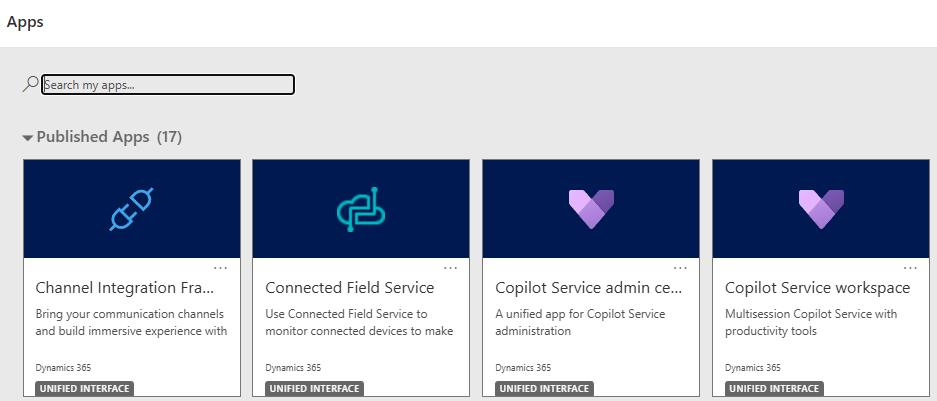

1. In the left navigation pane, in the **Workforce Management** section, select **Capacity Planning**.

	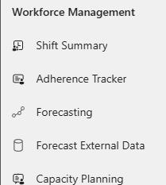

1. Select **+ New** and then select **Long-Term Capacity Plan**.

	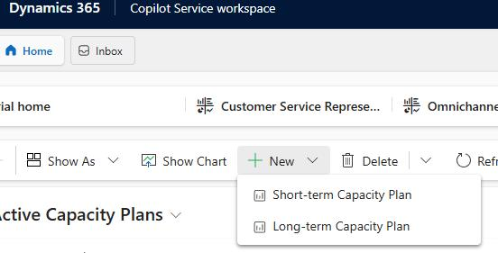

1. Configure the plan as follows:

    - **Details** tile:

        - **Name:** Capacity Long term - Conversation
        - **Forecast Scenario:** Sept Long Term - Conversation
        - **Interval:** Long term

    - **Forecast run schedule** tile:

        - **Auto-extension:** Yes
        - **Day of the week:** Sunday
        - **Recurrence time slot:** 12 AM - 3 AM
        - **Recurrence time zone:** Select your time zone

    > [!NOTE] 
    > In some environments, the capacity plan form doesn't include the Forecast run schedule tile. If it isn't available, make sure **Auto refresh after forecast** is set to **Yes** on the **Details** tile and continue with the lab.

    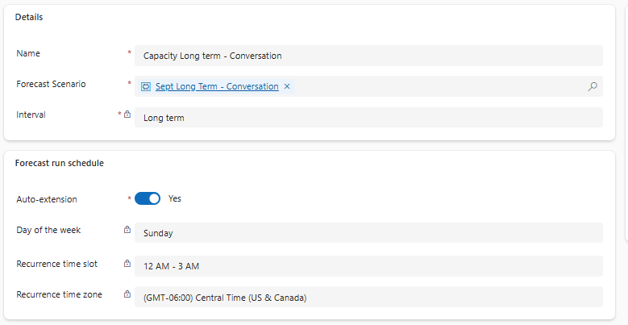

    - **Configuration parameters** tile:

        - **Service level (%):** 80
        - **Shrinkage (%):** 20
        - **Target answer time (seconds):** 60
        - **Concurrency:** 1

    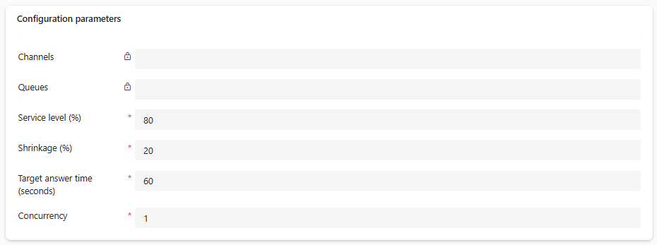

1. Select **Save & Close**.

---

#### 02: Create a long-term capacity plan for cases

1. Select **+ New** and then select **Long-Term Capacity Plan**.

	

1. Configure the plan as follows:

    - **Details** tile:

        - **Name:** Capacity Long term - Case
        - **Forecast Scenario:** Sept Long-term - Case
        - **Interval:** Long term

    - **Forecast run schedule** tile:

        - **Auto-extension:** Yes
        - **Day of the week:** Sunday
        - **Recurrence time slot:** 12 AM - 3 AM
        - **Recurrence time zone:** Select your time zone

    	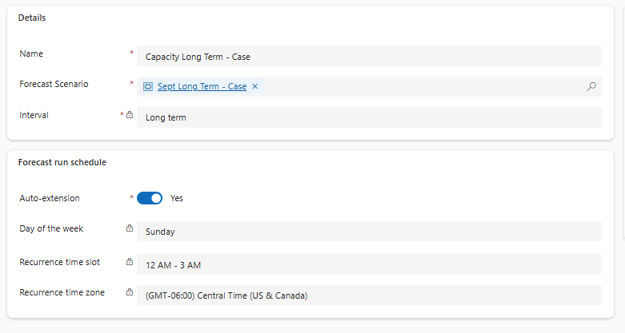

    - **Configuration parameters** tile:

        - **Service level (%):** 80
        - **Shrinkage (%):** 20
        - **Target answer time (seconds):** 60
        - **Concurrency:** 1

    	

1. Select **Save & Close**.

---

#### 03: Create a short-term capacity plan for conversations

1. Select **+ New** and then select **Short-Term Capacity Plan**.

1. Configure the plan as follows:

    - **Details** tile:

        - **Name:** Capacity Short term - Conversation
        - **Forecast Scenario**: Sept Short Term - Conversation
        - **Interval:** Short term

    - **Forecast run schedule** tile:

        - **Auto-extension:** Yes
        - **Recurrence time slot:** 12 AM - 3 AM
        - **Recurrence time zone:** Select your time zone

    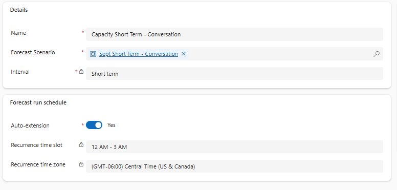

    - **Configuration parameters** tile:

        - **Service level (%):** 80
        - **Shrinkage (%):** 20
        - **Target answer time (seconds):** 60
        - **Concurrency:** 1

    

1. Select **Save & Close**.

---

#### 04: Create a short-term capacity plan for cases

1. Select **+ New** and then select **Short-Term Capacity Plan**.

1. Configure the plan as follows:

    - **Details** tile:

        - **Name:** Capacity Short term - Case
        - **Forecast Scenario**: Sept Short Term - Case
        - **Interval:** Short Term

    - **Forecast run schedule** tile:

        - **Auto-extension:** Yes
        - **Recurrence time slot:** 12 AM - 3 AM
        - **Recurrence time zone:** Select your time zone

    - **Configuration parameters** tile:

        - **Service level (%):** 80
        - **Shrinkage (%):** 20
        - **Target answer time (seconds):** 60
        - **Concurrency:** 1

    - Select **Save & Close**.

1. Your completed capacity plans should resemble the image below:

    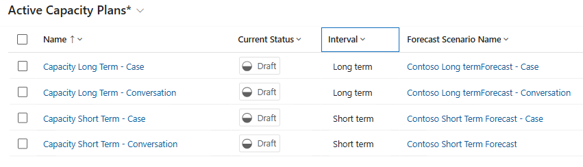

===

# Exercise 04: Implement shift planning and scheduling

## Introduction
With demand and capacity requirements defined, Contoso needs to operationalize staffing through consistent shift plans and schedules that align agent availability and skills to workload. This directly addresses the issues created by manual scheduling: missed shifts, uneven coverage across time zones, and limited flexibility for agents. In this exercise, you'll create a shift plan, schedule representatives, manage exceptions with extra bookings, make edits, publish the plan, and finalize bookings, building a repeatable scheduling process that supports both efficiency and agent experience.

===

## Task 01: Create a shift plan

### Introduction
Contoso needs a repeatable "shift blueprint" that reflects real work patterns across the day, instead of relying on ad-hoc manual schedules that miss breaks, training, and channel coverage needs.

### Description
In this task, you'll create a shift plan tied to a capacity plan, define the date range and working hours, and build an activity itinerary that includes support activities, breaks, and training.

### Success criteria
- A shift plan is created and saved with the correct date range, hours, capacity plan, and activity itinerary.

### Key steps

1. Open the **Copilot Service workspace** app (not **Copilot Service admin center**).

	

1. In the left navigation pane, in the **Workforce Management** section, select **Shift Planning**.

	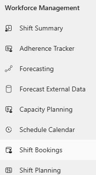

1. On the command bar, select **+ New** and then select **Schedule with capacity plan**.

	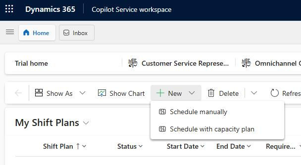

1. Configure the **Plan Details** tile by using the following information:

   > [!WARNING]
   > Once you save the shift plan, you can't change the start time, end time, or time zone.

    - **Shift Plan Name**: "Current Month Name" Shifts - Ex. Sept Shifts
    - **Start Date**: 1st day of the current month - Ex. 9/1/2025
    - **End Date**: Last day of the current month - Ex. 9/30/2025
    - **Capacity Plan:** Capacity Short Term Conversation
    - **Weekly Recurrence:** Sunday - Saturday (select all days)
    - **Start time**: 9:00 AM 
    - **End time**: 5:00 PM 
    - **Time zone**: Select your time zone. 

    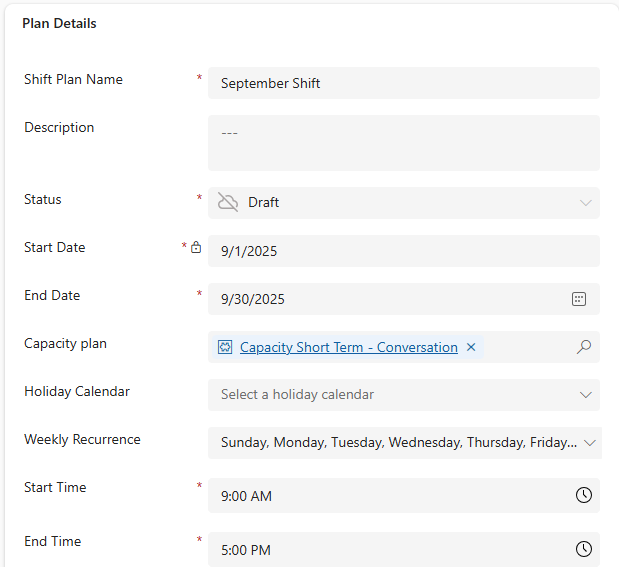

   > [!NOTE]
   > A capacity plan runs only after its linked forecast scenario creates a new snapshot. If the forecast scenario was completed before you created the capacity plan, the capacity plan stays in **Draft**. When you try to save a shift plan that uses it, you might see this error:
   >
   > *Validation failed. The linked Capacity Plan must be in the Completed state before this Shift Plan can be scheduled.*
   >
   > If this happens:
   >
   > 1. Open the linked capacity plan, and then select the forecast scenario in the **Forecast Scenario** field.
   > 2. On the command bar, select **Create New Snapshot**.
   > 3. Wait for the snapshot to finish. You can track it in **View Job History**.
   > 4. Go back to the capacity plan and select **Refresh** until **Current Status** shows **Completed**.
   > 5. Return to the shift plan and select **Save**.

1. Select **Save**.

1. On the **Activity Itinerary** panel in the middle of the screen, select **Add Activity**.

1. From the menu that appears, select **Chat Customer Support (01hr 30m)**.

1. Repeat Steps 6 and 7 to add the following activities:

	>[!WARNING]
    > It is important that you add the activities in the order listed.

    - Email Customer Support (01hr 30m)
    - Voice Customer Support (01hr 30m)
    - Break (30m)
    - Training (30m)
    - Break	(30m)

    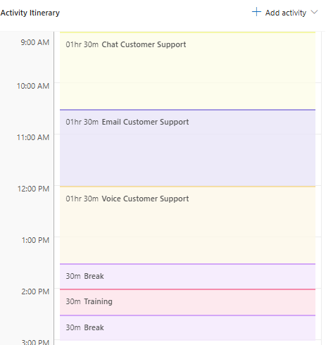

1. After the 30 min break, select **Add Activity**. From the menu that appears, select **Voice Customer Support**.

    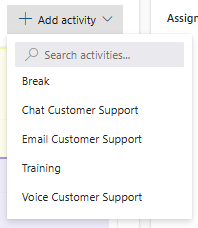

1. Change the duration to **two hours**.

   > [!NOTE]
   > If you can't change the duration of **Voice Customer Support** in the **Activity Itinerary**, update the activity's default duration instead:
   >
   > 1. Go to **Copilot Service admin center**.
   > 2. In the Workforce Management settings, select **Manage** next to **Shift activity types**, then open **Voice Customer Support** from the activities list.
   > 3. Change the duration to **2 hours**, and then select **Save & Close**.
   > 4. Return to the Shift Plan, delete the existing **Voice Customer Support** activity, and then select **Add activity** > **Voice Customer Support**.

1. Your completed shift plan should resemble the image below.

    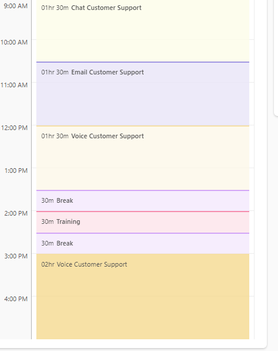

1. Select **Save**.

1. Leave the shift plan open.
===

## Task 02: Schedule customer service representatives

### Introduction
Once the shift plan exists, Contoso must assign the correct people to the plan so coverage matches demand and schedules become actionable for supervisors and agents.

### Description
In this task, you'll manually schedule customer service representatives into the shift plan, using both full-plan assignments and date-range assignments to reflect different availability windows.

### Success criteria
- Representatives are successfully scheduled into the shift plan and bookings appear on the schedule board as expected.

### Key steps

1. On the shift plan page, on the command bar, select **Schedule workforce**.

    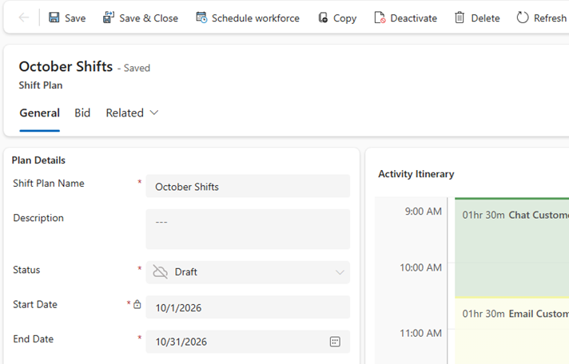

1. In the people list filter, select **All**.

    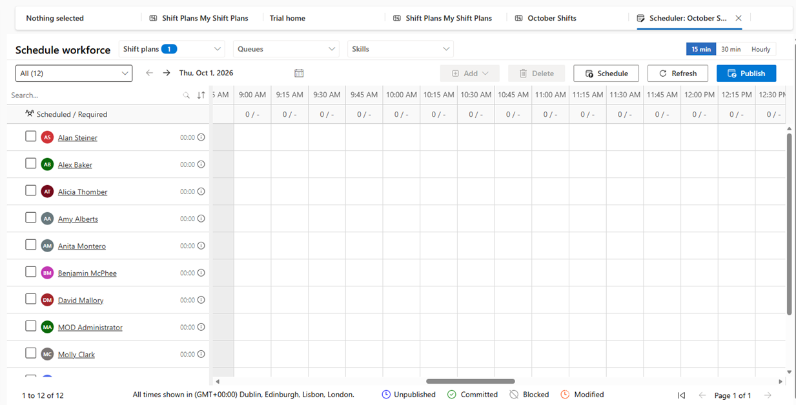

1. Select your administrative account.

    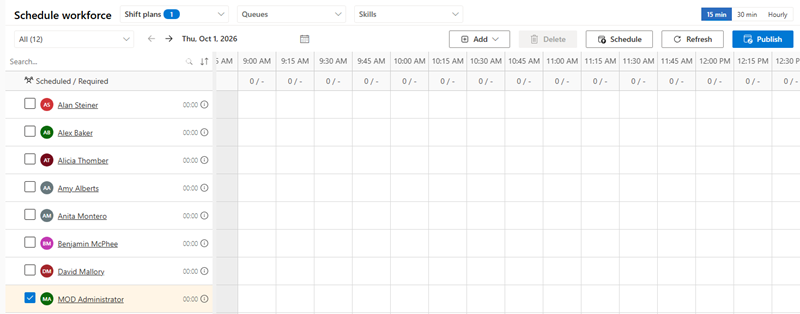

1. Select **Add** > **Add agents to schedule**.

1. Set **Add to entire shift plan** to **On**. 

1. Select **Save**. After a short period of time, your new bookings will appear in the shift plan.

    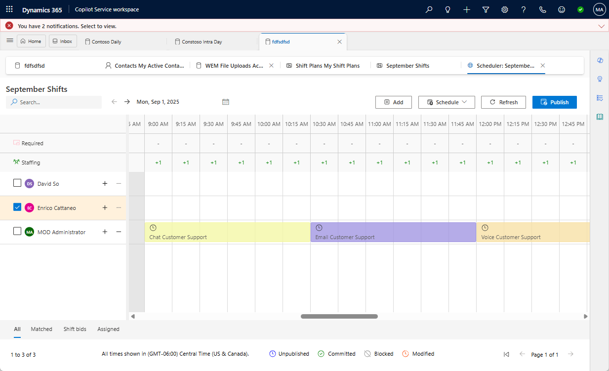

1. On the shift plan page, on the command bar, select **Schedule workforce**.

    

1. On the command bar that appears at the bottom of the page, select **All**.

    

1. Select **Alex Baker** and then select **Add** > **Add agents to schedule**.

1. Set **Add to entire shift plan** to **Off**. 

1. Configure the fields as follows:

    - **Start date:** 15th of the current month (e.g., 10/15/2026)
    - **End date:** 26th of the current month (e.g., 10/26/2026)

    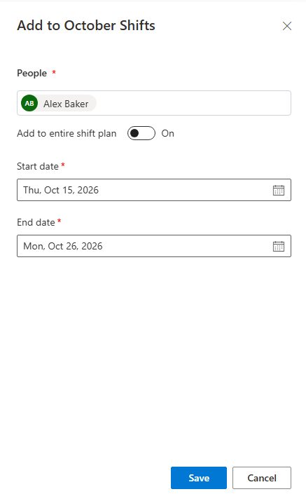

1. Select **Save**. After a short period of time, your new bookings will appear in the shift plan. Change the date range if needed to view the new bookings.

    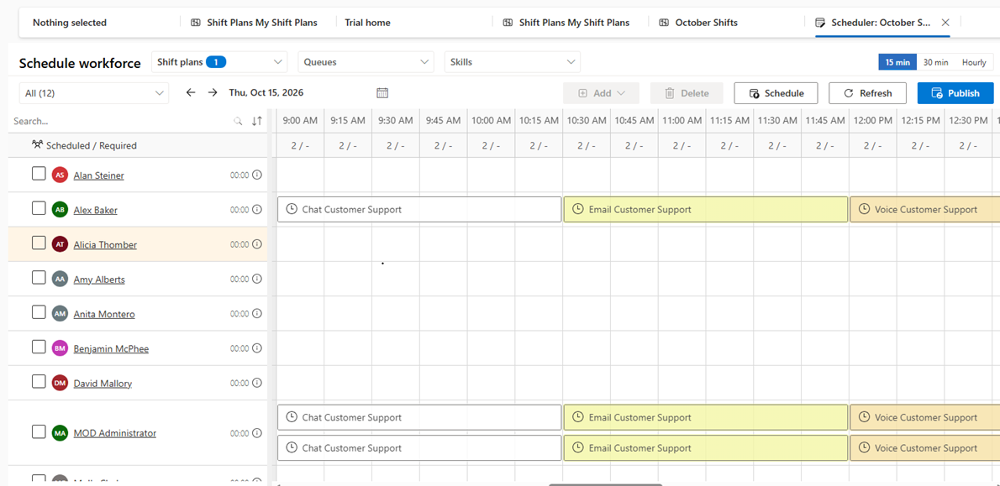

===

## Task 03: Add extra bookings

### Introduction

Unexpected demand spikes and operational changes require quick schedule adjustments without rebuilding the entire plan.

### Description
In this task, you'll add an extra shift booking for a representative by inserting additional scheduled activities on a specific date and time.

### Success criteria
- Additional shift bookings are created for the selected representative and display correctly on the schedule board.

### Key steps

1. Open the **October Shift plan** calendar.

1. At the top of the **Calendar**, select the **Date** selector.

    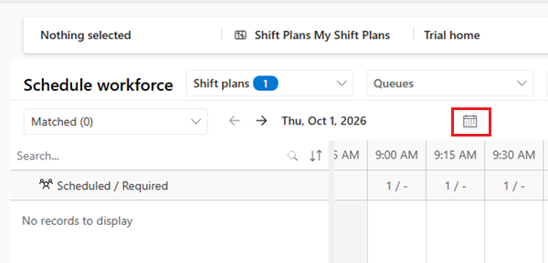

1. Select the **29th**.

1. Go to the **10:00 AM** time slot for Alex.

1. Right-click the time slot and then select **Add Shift Booking**.

    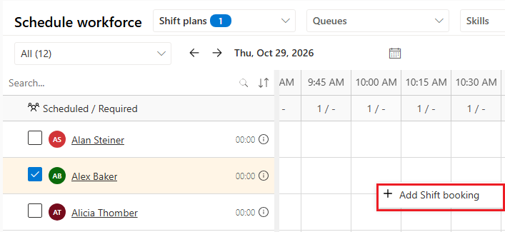

1. Configure the fields as follows:

    - **Staff member**: Alex Baker (or similar)
    - **Date:** The 29th of the current month - Ex. 10.29.2026
    - **Type:** Chat Customer Support
    - **Start Time:** 10:00 AM
    - **End time:** 11:30 AM

    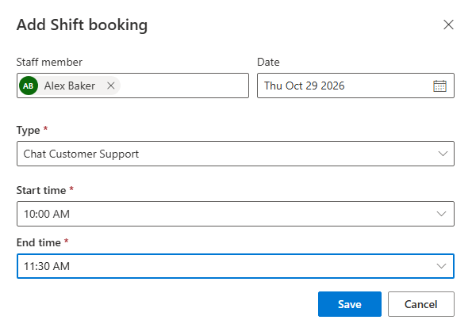

1. Select **Save**.

1. Go to the **12:00 PM** time slot for Alex.

1. Right-click the time slot and then select **Add Shift Booking**.

    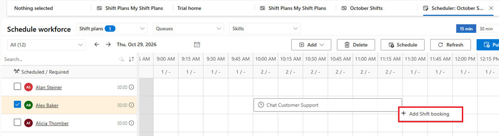

1. Configure the fields as follows:

    - **Staff member**: Alex Baker
    - **Date:** 10.29.2026
    - **Type:** Training
    - **Start Time:** 12:00 PM
    - **End time:** 12:30 PM
    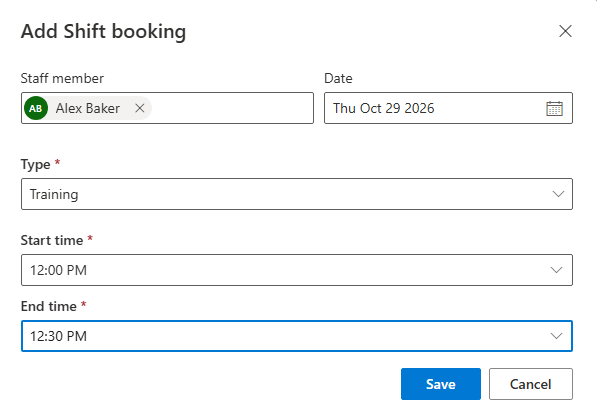

1. Select **Save**.

===

## Task 04: Edit and delete existing shift bookings

### Introduction

Supervisors need the ability to correct scheduling changes quickly, whether it's moving an activity window or removing it entirely.

### Description

In this task, you'll edit an existing shift booking to update its time and then delete a booking to demonstrate schedule maintenance.

### Success criteria
- A shift booking is successfully edited and then deleted, with the schedule board reflecting both changes.

###Key steps
1. On the schedule board, right-click the **Training** booking you just created.

1. Select **Edit Shift booking**.

1. Edit the fields as follows:

    - **Staff member**: Alex Baker
    - **Date:** the 29th of the current month - Ex: 9.29.2025
    - **Type:** Training
    - **Start Time:** 12:30 PM
    - **End time:** 1:00 PM

    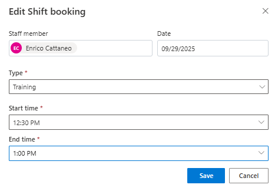

1. Select **Save**.

1. To delete the **Training booking**, right-click the booking and then select **Delete**.

===

## Task 05: Publish a shift plan

### Introduction
Publishing is the point where planned schedules become visible and actionable, enabling Contoso to move from planning to execution.

### Description
In this task, you'll publish the shift plan so bookings are released for downstream use in calendars and agent experiences.

### Success criteria
The shift plan is published successfully, and the bookings are available as published schedule items.

### Key steps

1. On the schedule board for the shift plan, select **Publish**. 

   > [!NOTE]
   > If you have items that span multiple months, you'll be asked to provide the month that you want to publish.

1. In the **Send bookings to agents** dialog, set the **Start date** to the first day of the current month and the **End date** to the last day of the current month.

   > [!NOTE]
   > The dialog displays the number of bookings in the selected date range. Agents with unpublished bookings in that range will be notified and need to accept them.

1. Select **Continue**.

   > [!NOTE] 
   > You'll need to repeat this step for each month for the shift plan.

===

## Task 06: Accept bookings

### Introduction
To ensure schedules appear promptly and consistently for agents, Contoso may need to bulk-confirm bookings so they reflect as accepted on calendars.

### Description
In this task, you'll filter shift bookings for a specific resource, bulk edit them, and update the booking status to Accepted.

### Success criteria
- Shift bookings for the selected resource are updated to Accepted in bulk and reflect the new status.

### Key steps

1. In **Copilot Service workspace**, in the left navigation pane, in the **Workforce management** group, select **Shift Bookings**.

	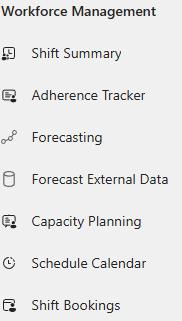

1. Select the **Resource** column and then select **Filter by**.

    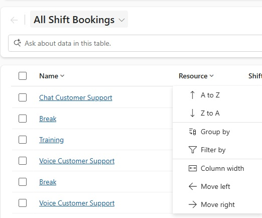

1. Enter the name of your administrative account and then select **Apply**.

1. Select all shift bookings.

1. On the command bar, select **Edit**.

1. In the **Booking Status** field, select **Committed**.

    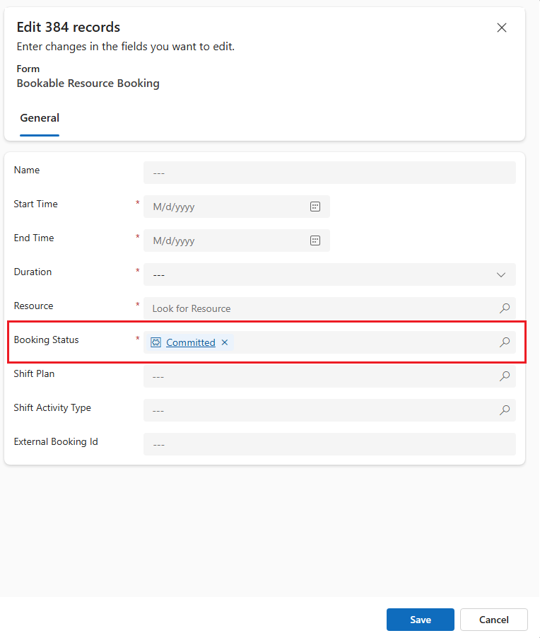

1. Select **Save**.

===
# Exercise 05: Demonstrate Workforce Management features to a customer

## Introduction

Contoso's story is familiar: rapid growth, complex customer needs, and a contact center stretched thin. With over 2,000 agents, manual scheduling and outdated ServiceNow and Genesys Engage solutions have led to inefficiencies, long wait times, and agent burnout.

The business impact? Customer satisfaction has dropped, costs are rising, and agents are overwhelmed with basic requests that could be handled more smartly. Supervisors are buried in manual shift swaps and compliance headaches, while managers struggle to plan capacity with only historical data and gut instinct.

## Business Value Statements:

These represent some example themes that should be part of your narrative. As you demo the functionality to your customer, you should come back to these themes and reiterate them throughout your demo.

Here are some example business value statements you can use for your Dynamics 365 Contact Center Workforce Management demo, tailored to the Contoso Coffee scenario:

## Business Value Statements:

- Dynamics 365 enables Contoso to optimize agent schedules in real time, reducing wait times and improving customer satisfaction.

- Automated shift management minimizes manual errors, ensures compliance, and boosts agent morale by making scheduling simple and transparent.

- AI-driven capacity planning helps Contoso match staffing levels to actual demand, cutting operational costs and eliminating overstaffing during slow periods.

- Unified workforce management tools empower supervisors to coordinate shift swaps, breaks, and overtime efficiently, freeing up time for higher-value tasks.

- Embedded analytics provide actionable insights, allowing Contoso to proactively address service bottlenecks and improve first-contact resolution rates.

- Modern cloud-based solutions replace outdated systems, streamlining operations and supporting seamless omnichannel customer experiences.

- Enhanced agent productivity leads to faster issue resolution, higher CSAT scores, and improved employee retention.

## Items to highlight as you are demonstrating:

- **Refer to our AI-Driven Scheduling & Shift Management which can:**

    - Automatically match agent schedules to real-time demand, reducing overstaffing during slow periods and understaffing during peak times.

    - Streamline shift swaps, breaks, and overtime requests, minimizing manual errors and compliance risks.

- **Speak to our predictive capacity planning**

    - Uses real-time analytics and forecasting to anticipate seasonal spikes and business growth, enabling proactive staffing decisions instead of reactive guesswork.

- **Because of the complexities of their current solution, call out our Unified Agent Experience, which:**

    - Provides a single pane of glass for agents and supervisors, eliminating tool overload and reducing time spent switching between platforms.

    - Integrates seamlessly with omnichannel support (phone, email, chat), improving agent productivity and customer experience.

- **Refer to our Cloud-Based Scalability & Security which:**

- Supports secure remote access and compliance with privacy regulations, while scaling easily to meet Contoso's rapid growth and expanding customer base.

### Demo flow:

- Walk them through what the user interface looks like.
- Show the forecast builder and explain how historical data is used.
- Walk through the schedule creation and highlight optimization.
- Switch to the agent view and demonstrate shift bidding and time-off requests.
- Open the real-time adherence dashboard and show how supervisors can act quickly.

===

## Task 01: Showcase the user interface

Take customers on a tour of the user interface.  Call out the available features.

===

## Task 02: Demo forecasting

---

#### View forecast reports
For each scenario, the following details are displayed: Name, Current Status, Interval, Duration, Target entity, Last Run On, Recurrence time slot, and Recurrence time zone.

1. Open the **Copilot Service workspace** app.

1. Using the navigation on the left, select **Forecast** scenarios under **Workforce Management**.

1. Select the **Reports** tab.

> [!NOTE]
> When you first access the dashboard, any scenarios you configured appear in Draft status until the first trigger occurs. After that, the scenario shows as In progress until it completes. You should make sure that you have done this first.

---

#### Data visualization

Walk customers through the forecasting reports. Walk them through the Trend chart and talk about how it shows the actual historical volumes from the past to the predicted volume in the future. The forecast is based on actual case and conversation records created in the past.

Detailed view: You can filter the data in the following ways:

- **All:** Displays the actual and forecasted numbers across all channels and queues.
- **Channel:** Displays the actual and forecasted numbers, sliced by each channel.
- **Queue:** Displays the actual and forecasted numbers, sliced by each queue.

===

## Task 03: Demo capacity planning features

---

#### View capacity plans

1. Open the **Copilot Service workspace** app.

1. In the left navigation, under **Workforce Management**, select **Capacity planning**.

1. Select the plan you want to view from the list, and then select the **View Output** tab.

---

#### Showcase data filters and visualizations

When you open a report, the following filters and visualizations are available:

- **Duration**: Allows you to enter the date range or use the sliders to set the dates.
- **Intervals**: Select the **Daily**, **Weekly**, or **Monthly** view.
- **Channel**: Select one or more channels for which you want data displayed.
- **Queue**: Select one or more queues for which you want data displayed.

In the Capacity Plan Output section, Detailed view, you can filter the data in the following ways:

- **All**: Displays the capacity numbers across all channels and queues.
- **Channel**: Displays the capacity numbers, sliced by each channel.
- **Queue**: Displays the capacity numbers, sliced by each queue.

You can use the drill up and down buttons to drill to specific levels in the hierarchy.

For all the filters, you can use the drill up and down buttons to drill to specific levels in the hierarchy.

===

## Task 04: Demo scheduling features

---

#### View the calendar

1. In the **Copilot Service workspace** app, select **Schedule Calendar** under **Workforce Management**.

1. Use the top-right menu to change the view to Agenda, Day, Week, or Month.

1. Show the Calendar view of a service representative's schedule with the menu to change views expanded.

    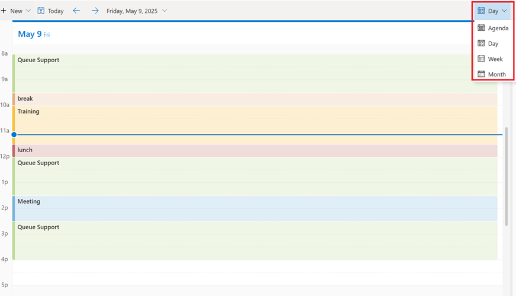

   > [!NOTE] 
   > If Schedule Calendar opens to a blank page and the view options aren't available, skip the remaining steps in this section and continue to **Use auto scheduling**.

---

#### Use auto scheduling

1. Using the navigation on the left, select **Shift planning** under **Workforce Management.**

1. Select the shift plan you want to use to book the representatives, and then select **Schedule workforce** on the task bar. The shift scheduler board appears.

1. Select **Schedule**. The **Schedule** pane appears.

1. For **Duration**, select the start and end dates for the activity.

1. Toggle on the filters for **Agent availability**, **Match Skills**, and **Match Queue**.

1. Set the availability order to either **Most Available to Least** or **Least Available to Most**.

1. Select **Schedule**. The schedule board updates and populates the activities for the agents in the activity itinerary.

1. Select **Publish**.

1. In the **Send bookings to agents** dialog, select a **Start date** and **End date** for the bookings you want to send, and then select **Continue**.

---

#### Use shift bidding

1. In the site map of **Copilot Service workspace**, select **Request Management** under **Workforce Management**.

1. Select **+ New**, and then select **Shift Bid**.

1. On the **Shift Plan To Bid** card, select the shift plan you want to bid on.

1. Review the bid request details, and then select **Save**.

> [!NOTE] 
> If no shift plans are available for bidding, open the shift plan, select the Bid tab, set a Bid Expiration Date, change Released For Bid to Yes, and save the shift plan.

---

#### Create a shift swap request

1. In the site map of **Copilot Service workspace**, select **Request Management** under **Workforce Management**.

1. Select **+ New**, and then select **Shift Swap** from the dropdown menu. The **New WEM Request** page appears.

1. On the **Select shift** card, enter the details as follows:

    - **Date:** Select the date for the shift you want to swap.

    - **Shift Plan:** Select the name of the plan you want to use for the swap.

    - **Full shift day:** If you want the entire shift to be included in the swap, set Full shift day to **Yes**.

    - **Booking:** For a shift swap that doesn't include the entire shift, select the activity to swap. The form populates the **Start Time** and **End Time** for the booking and calculates the **hours**.

    - **Note:** Type a note if desired.

1. On the **Select shift to swap** card, enter your **Availability date** and **Preferred time range** if available, so that others know when you're available to swap a shift.

1. If you want the system to notify all representatives who meet your availability criteria, toggle on **Public Post**. If the setting is off, the system lists other representatives' available bookings that can be swapped, and then you can select the shift you want to use and complete the swap.

1. Select **Save**.

===

> [!WARNING]
> These labs are hosted on the Skillable platform. Completion data is collected and then exported to Success Factors every Monday. SF requires another 1-3 days to process that data. The status for this lab will be visible in Viva and Learning Path next week.

Be sure to select "**Submit**" in the bottom right corner to get credit for completing this lab. 

@lab.ActivityGroup(completionsurvey)

> [!WARNING]
> After answering the survey questions, select **submit** to complete and end the lab. **This is required in order to receive credit for lab completion**.

